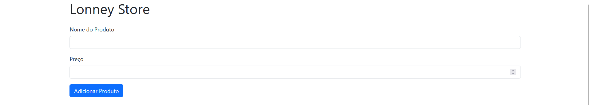
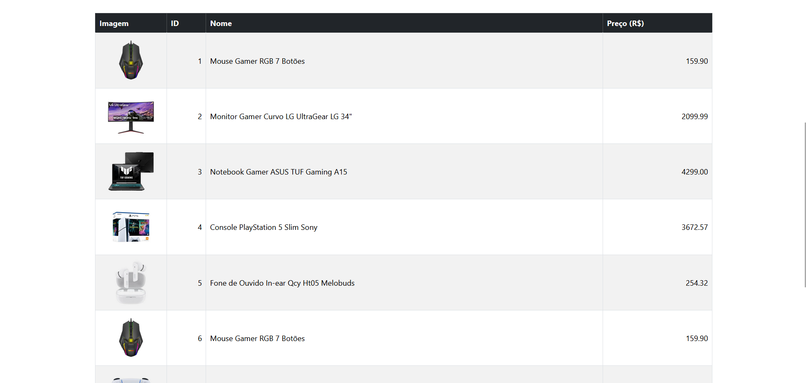

# 🛍️ API de Produtos - Spring Boot + Front Bootstrap

Uma API REST simples de produtos, feita com **Java + Spring Boot**, com um frontend em **HTML + Bootstrap** para consumir os endpoints via `fetch`.

Projeto ideal pra quem quer aprender o fluxo completo de requisições GET/POST, estrutura de projeto Spring, e integração com frontend puro.

## 🚀 Funcionalidades

- ✅ Listagem de produtos (`GET /produtos`)
- ✅ Cadastro de novos produtos (`POST /produtos`)
- ✅ Armazenamento em memória (sem banco de dados)
- ✅ CORS liberado pra integração com frontend
- ✅ Frontend em Bootstrap (UI simples e direta)

## 🧩 Estrutura do Projeto

```bash
src
├── controller     # Endpoints da API (ProdutoController)
├── model          # Classe Produto
├── service        # Lógica de negócio
└── repository     # Simulação de repositório (MySQL)
```

## 🔗 Endpoints

### 📥 POST `/produtos`
Cria um novo produto.

#### 🧪 Exemplo de corpo:
```json
{
  "nome": "Cadeira Gamer RGB",
  "preco": 999.90
}
```



---

### 📤 GET `/produtos`
Retorna todos os produtos cadastrados.



---

### 📤 ERROR
Retorna mensagem de erro se houver erro com a API.


## 🖥️ Frontend

O frontend consome a API com `fetch` e exibe os dados em uma tabela Bootstrap. Também é possível adicionar produtos via formulário.

📂 Arquivos: `script.js`

## 🛠️ Tecnologias

- Java 21
- Spring Boot 3.4.4
- Bootstrap 5
- HTML, CSS e JS puro
- Postman (pra testes de API)

## 💡 Próximos passos

- [ ] Adicionar método DELETE
- [ ] Adicionar método UPDATE
- [ ] Criar tratamento de erros
- [ ] Melhorar layout do frontend
- [ ] Adicionar método para adicionar uma lista de produtos

---
